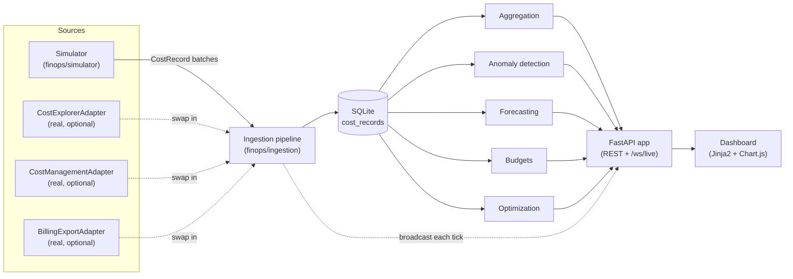

# Architecture

## The pipeline, end to end



Everything downstream of the database only ever talks to `CostRecord`
rows - the analytics modules, the API, and the dashboard have no idea
whether the data came from the simulator or a real cloud bill. That's the
one architectural decision this whole project hangs off of: normalize at
the edge, keep everything else provider-agnostic.

## Package layout

```
src/finops/
  models.py           # CostRecord - the shared schema, see 03-data-model.md
  providers/          # per-cloud adapters (simulated + real), see 10-multi-cloud-normalization.md
    base.py           # CostAdapter interface
    aws.py            # CostExplorerAdapter (real, needs boto3 + creds)
    azure.py          # CostManagementAdapter (real, needs azure sdk + creds)
    gcp.py            # BillingExportAdapter (real, needs bigquery + creds)
  simulator/          # generates the demo data, see 05-real-time-pipeline.md
    catalog.py        # service/region/pricing reference data
    generator.py       # FleetSimulator - builds a fleet, advances it tick by tick
  storage/
    db.py             # sqlite schema + connection helpers
  ingestion/
    pipeline.py       # backfill() and run_live()
  analytics/
    aggregation.py    # cost by dimension, trends, month-to-date
    anomaly.py        # z-score based resource-level anomaly detection
    forecast.py       # run-rate + linear trend month-end projection
    budgets.py        # budget evaluation against config/budgets.yaml
    optimization.py   # idle resource + commitment coverage recommendations
  api/
    app.py            # FastAPI app, REST endpoints, websocket broadcaster
  web/
    templates/        # dashboard.html
    static/           # dashboard.js, style.css
  cli.py              # `finops` command line entry point
```

## How "real-time" actually works here

There's a background thread (started in the FastAPI app's lifespan hook)
running `finops.ingestion.pipeline.run_live`. Every `tick_seconds` (5s by
default) it asks the simulator for one more hour of simulated fleet
activity, writes those records to SQLite, and hands the batch to a
`Broadcaster` that fans it out over the `/ws/live` websocket to whatever
dashboards are open. The dashboard also polls the REST endpoints every 20
seconds for the aggregate views (charts, tables) since those are more
expensive to keep live-pushing and don't need sub-20-second freshness.

The one subtlety worth calling out: the simulator runs on a plain Python
thread, not inside FastAPI's asyncio event loop, because `time.sleep` in a
loop is a much simpler mental model than making the whole simulator async
for no real benefit. Getting a value from that thread onto the event loop
(so it can go out over a websocket, which is async) needs
`asyncio.run_coroutine_threadsafe` - that's what `Broadcaster.publish`
does. If you've never had to bridge a sync background thread into an
asyncio app before, this is a small, self-contained example of the
pattern.

Also worth knowing: sqlite3 connections are only safe to use on the thread
that created them. The background thread opens its own connection rather
than reusing one created during app startup - see the `_run_simulator`
closure in `finops/api/app.py`. Every REST request also opens and closes
its own connection. This is fine at demo scale; see
[12-going-to-production.md](12-going-to-production.md) for what changes at
real scale.

Next: [03-data-model.md](03-data-model.md).
